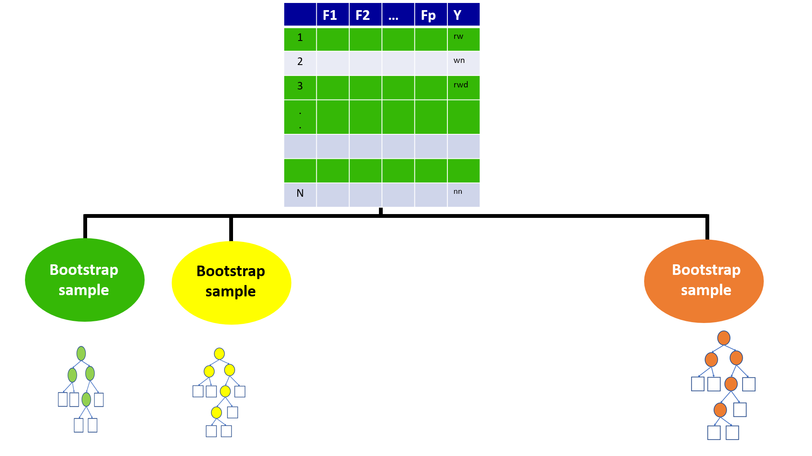

```{r,setup, include=FALSE}
knitr::opts_chunk$set(cache=TRUE)
```

## Decision Tree

```{r, echo=FALSE}
data <- iris[1:100,]
library(rpart)
library(rpart.plot)
# Create a decision tree model
tree <- rpart(Species~Sepal.Length + Sepal.Width, data=data, cp=.02)
# Visualize the decision tree with rpart.plot
rpart.plot(tree, box.palette="RdBu", shadow.col="gray", nn=TRUE)

```

## Decision boundary

```{r, echo=FALSE, message=FALSE, warning=FALSE}
library(tidyverse)
ggplot(data, aes(x=Sepal.Length, y=Sepal.Width, col=Species)) + geom_point() + scale_color_manual(values = c("#1b9e77", "#d95f02")) + coord_fixed() + geom_vline(xintercept = 5.5) + geom_hline(yintercept = 3) + geom_hline(yintercept = 3.3)
```

## Decision trees - Limitation

To capture a complex decision boundary we need to use a deep tree

In-class explanation

## Bias-Variance Tradeoff

- A deep decision tree has low bias and high variance. 


## Bagging (Bootstrap Aggregation)

- Technique for reducing the variance of an estimated predicted function

- Works well for high-variance, low-bias procedures, such as trees

## Ensemble Methods

- Combines several base models


- **Bagg**ing (**B**ootstrap **Agg**regation) is an ensemble method

<!--The main idea is that each individual learner is weak and therefore less likely to pick up on every single pattern so the more learners you have the better.-->

## Ensemble Methods

"Ensemble learning gives credence to the idea of the “wisdom of crowds,” which suggests that the decision-making of a larger group of people is typically better than that of an individual expert."

Source: https://www.ibm.com/cloud/learn/boosting

## Bootstrap

- Generate multiple samples of training
data, via bootstrapping

Example

Training data: $\{(y_1, x_1), (y_2, x_2), (y_3, x_3), (y_4, x_4)\}$

Three samples generated from bootstrapping

Sample 1 = $\{(y_1, x_1), (y_2, x_2), (y_3, x_3), (y_4, x_4)\}$

Sample 2 = $\{(y_1, x_1), (y_1, x_1), (y_1, x_1), (y_4, x_4)\}$

Sample 3 = $\{(y_1, x_1), (y_2, x_2), (y_1, x_1), (y_4, x_4)\}$

## Aggregation


- Train a decision tree on each bootstrap sample of data without pruning.

- Aggregate prediction using either voting or averaging

## Bagging - in class diagram


## Bagging

**Pros**

- Ease of implementation

- Reduction of variance


**Cons**

- Loss of interpretability

- Computationally expensive

## Bagging

- Bootstrapped subsamples are created

- A Decision Tree is formed on each bootstrapped sample.

- The results of each tree are aggregated


## Random Forests: Improving on Bagging

- The ensembles of trees in Bagging tend to be
highly correlated.

- All of the bagged trees will look quite similar to each other. Hence, the predictions from the bagged trees will be highly correlated.


## Random Forests

1. Bootstrap samples

2. At each split, randomly select a set
of predictors from the full set of predictors

3. From the selected predictors we select the
optimal predictor and the optimal corresponding
threshold for the split.

4. Grow multiple trees and aggregate

## Random Forests - Hyper parameters

1. 	
Number of variables randomly sampled as candidates at each split

2. 	Number of trees to grow

3. Minimum size of terminal nodes. Setting this number larger causes smaller trees to be grown (and thus take less time).

Note: In theory, each tree in the random forest is full (not pruned), but in
practice this can be computationally expensive,thus, imposing a minimum node size is not unusual.

## Random Forests

- Bagging ensemble method

- Gives final prediction by aggregating the predictions of bootstrapped decision tree samples. 

- Trees in a random forest are independent of each other.

## Random Forests

**Pros**

- Accuracy

**Cons**

- Speed

- Interpretability

- Overfitting

## Out-of-bag error

With ensemble methods, we get a new metric for assessing the
predictive performance of the model, the out-of-bag error

## Random Forests


## Random Forests




## Out-of-Bag (OOB) Samples


## Out-of-Bag (OOB) Samples


## Predictions based on OOB observations


## Predictions based on OOB observations


## Predictions based on OOB observations


## Predictions based on OOB observations


## Predictions based on OOB observations


## Predictions based on OOB observations


## Predictions based on OOB observations


## Predictions based on OOB observations


## Predictions based on OOB observations


## Variable Importance in Random Forest

**contribution to predictive accuracy**

- Permutation-based variable importance

- Mean decrease in Gini coefficient

## Permutation-based variable importance

-  the OOB samples are passed down the tree, and the prediction accuracy is recorded

- the values for the $j^{th}$ variable are randomly permuted in the OOB samples, and the accuracy is again computed.

- the decrease in accuracy as a result of this permuting is averaged over all trees, and is used as a measure of the importance of variable $j$ in the random forests

## Mean decrease in Gini coefficient

- Measure of how each variable contributes to the homogeneity of the nodes and leaves in the resulting random forest

- The higher the value of mean decrease accuracy or mean decrease Gini score, the higher the importance of the variable in the model

## Boosting

- Bagging and boosting are two main types of ensemble learning methods. 

- The main difference between bagging and boosting is the way in which they are trained.

- In bagging, weak learners (decision trees) are trained in parallel, but in boosting, they learn sequentially.

## Boosting

1. Fit a single tree

2. Draw a sample that gives higher selection probabilities to misclassified records

3. Fit a tree to the new sample

4. Repeat Steps 2 and 3 multiple times

5. Use weighted voting to classify records, with heavier weights for later trees


## Boosting 

- Iterative process. 

- Each tree is dependent on the previous one. Hence, it is hard to parallelize the training process of boosting algorithms.

- The training time will be higher. This is the main drawback of boosting algorithms.


## Boosting Algorithms

- Adaptive boosting or AdaBoost

- Gradient boosting

- Extreme gradient boosting or XGBoost


