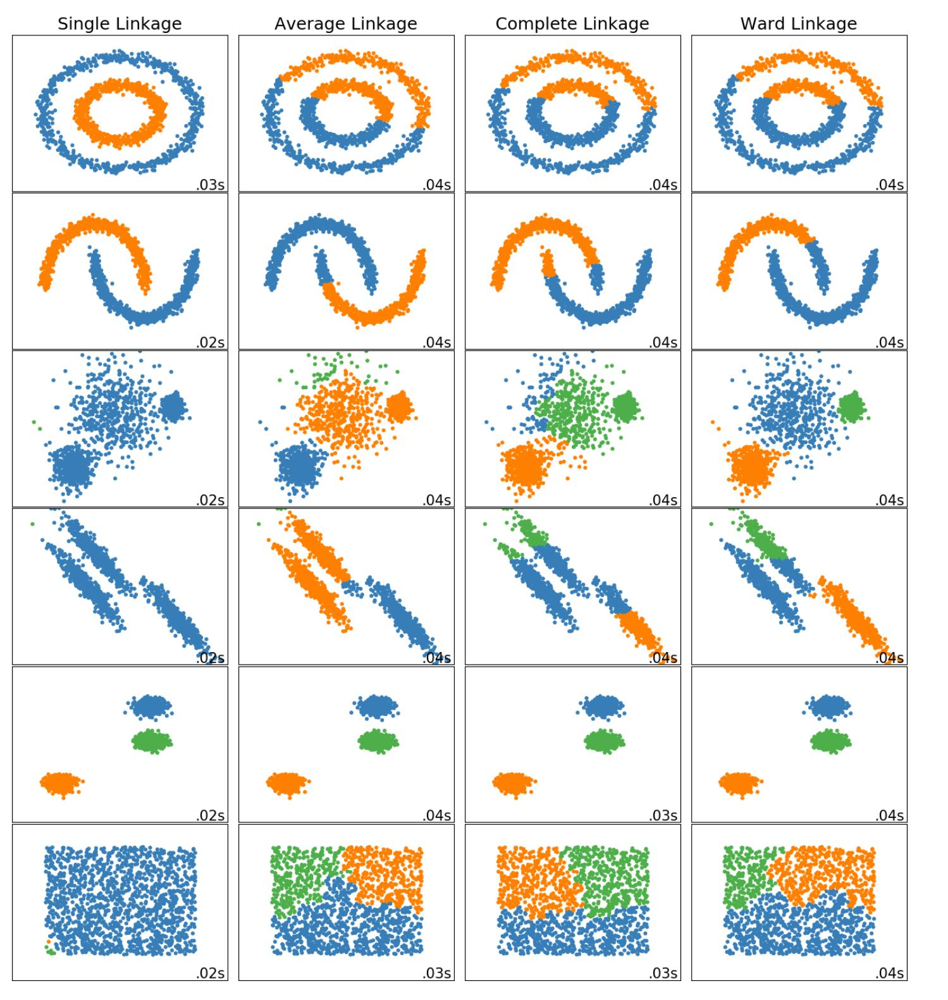

```{r setup, include=FALSE}
knitr::opts_chunk$set(echo = TRUE)
```

# Cluster Analysis

- Unsupervised learning task

- Group sets of objects that share similar characteristic

- Good clustering:

    - Observations in one cluster are highly similar
    
    - Observations in different clusters are dissimilar
    
- Categorization of clustering methods

  1. Hierarchicals 
      
      - Agglomerative
      
      - Divisive
      
  2. Non-hierarchical 
  
      Eg: $k$-means
      
- Distance measures

    - Distance between two records 
    
    - Distance between two clusters
    
# Measuring Distance Between Two Records

## Properties of distance measures

1. Non-negative: $d_{ij} \geq 0$

2. Self-proximity: $d_{ii} = 0$ (distance to itself is zero)

3. Symmetry: $d_{ij} = d_{ji}$

4. Triangle inequality: $d_{ij} \leq d_{ik} + d_{kj}$ 

## Notations

$d_{ij}$ - distance metric/ dissimilarity measure between $i$ and $j$ records

For $i$ record we have $p$ measurements $(x_{i1}, x_{i2}, ..., x_{ip})$ and for $j$ record we have $p$ measurements $(x_{j1}, x_{j2}, ..., x_{jp})$

## Measures for numerical data

1. Euclidean Distance

    - Scale dependent

    - Changing the units of one variable have a huge influence on the results

$$d_{ij} = \sqrt{ (x_{i1} - x_{j1})^2 + (x_{i2} - x_{j2})^2 + ...+ (x_{ip} - x_{jp})^2}$$

2. Correlation-based similarity

$$r_{ij} = \frac{\sum_{m=1}^p (x_{im} - \bar{x}_i)(x_{jm} - \bar{x}_j)}{\sqrt{\sum_{m=1}^p (x_{im} - \bar{x}_i)^2 \sum_{m=1}^p (x_{jm} - \bar{x}_j)^2}}$$

$$d_{ij} = 1-r^2_{ij}$$


3. Manhattan distance (city block)

$$d_{ij} = |x_{i1}-x_{j1}| + |x_{i2}-x_{j2}|+...+|x_{ip}-x_{jp}|$$

4. Maximum coordinate distance: measurement on which $i$ and $j$ deviate most.

$$d_{ij} = max_{(m=1, 2, ..p)}|x_{im} - x_{jm}|$$

5. Mahalanobis distance

$$d_{ij} = \sqrt{(\mathbf{x_i}-\mathbf{x_j})'S^{-1}(\mathbf{x_i}-\mathbf{x_j})}$$

$\mathbf{x_i}$ and $\mathbf{x_j}$ are $p$-dimensional vectors of the mesurements values for records $i$ and $j$, respectively; $S$ is the covariance matrix for these vectors.

## R- Codes

Example data

```{r}
#define four vectors
a <- c(12, 14, 4, 6)
b <- c(5, 4, 6, 3)
c <- c(9, 6, 9, 7)
d <- c(10, 12, 3, 13)
mat <- rbind(a, b, c, d)
mat
```

```{r}
dist(mat, method="euclidean")
dist(mat, method="manhattan")
dist(mat, method="maximum")

```

## Distance measures for categorical data


<style type="text/css">
.tg  {border-collapse:collapse;border-spacing:0;}
.tg td{border-color:black;border-style:solid;border-width:1px;font-family:Arial, sans-serif;font-size:14px;
  overflow:hidden;padding:10px 5px;word-break:normal;}
.tg th{border-color:black;border-style:solid;border-width:1px;font-family:Arial, sans-serif;font-size:14px;
  font-weight:normal;overflow:hidden;padding:10px 5px;word-break:normal;}
.tg .tg-0lax{text-align:left;vertical-align:top}
</style>
<table class="tg">
<thead>
  <tr>
    <th class="tg-0lax"></th>
    <th class="tg-0lax">0</th>
    <th class="tg-0lax">1</th>
    <th class="tg-0lax"></th>
  </tr>
</thead>
<tbody>
  <tr>
    <td class="tg-0lax">0</td>
    <td class="tg-0lax">a</td>
    <td class="tg-0lax">b</td>
    <td class="tg-0lax">a+b</td>
  </tr>
  <tr>
    <td class="tg-0lax">1</td>
    <td class="tg-0lax">c</td>
    <td class="tg-0lax">d</td>
    <td class="tg-0lax">c+d</td>
  </tr>
  <tr>
    <td class="tg-0lax"></td>
    <td class="tg-0lax">a+c</td>
    <td class="tg-0lax">b+d</td>
    <td class="tg-0lax">n</td>
  </tr>
</tbody>
</table>


1. Matching coefficient

$$\frac{a+d}{n}$$

2. Jaquard's coefficient

$$\frac{d}{(b+c+d)}$$

## Distance measures for mixed data

- Gower's similarity measure

# Measuring Distance Between Two Clusters

Consider cluster $A$, which includes the $m$ records $A_1, A_2,...A_m$ and Cluster B, which includes $n$ records $B_1, B_2, ...B_n$.

1. Minimum distance

$$min(distance(A_i, B_j)), \text{ } i= 1, 2, ...m; \text{ } j=1, 2, ...n$$

2. Maximum distance

$$max(distance(A_i, B_j)), \text{ } i= 1, 2, ...m; \text{ } j=1, 2, ...n$$

3. Average distance

$$Average(distance(A_i, B_j)), \text{ } i= 1, 2, ...m; \text{ } j=1, 2, ...n$$

4. Centroid distance

$$distance(\bar{x}_A, \bar{x}_B)$$

# Hierarchical (Agglomerative) Clustering

1. Start with each cluster comprising exactly one record (number of observations = number of clusters)

2. At every step, the two clusters with the smallest distance are merged.

Repeatedly links pairs of clusters until every data object is included in the hierarchy ( until there is only one cluster left at the end or a specified termination condition is satisfied).

## Linkage criterion to merge data point

1. Single linkage: minimum distance

2. Complete linkage: maximum distance

3. Average linkage: average distance (between all pairs of records)

4. Centroid linkage: centroid distance (clusters are represented by their mean values for each variable, which forms a vector of means)

5. Ward's method: Consider "loss of information" that occurs when records are clustered together.


Further reading and source: https://livebook.manning.com/book/machine-learning-for-mortals-mere-and-otherwise/chapter-17/v-7/65



Source: https://stats.stackexchange.com/questions/426760/should-we-most-of-the-time-use-wards-method-for-hierarchical-clustering

<!--Source: https://dataaspirant.com/hierarchical-clustering-r/-->

# Dendrogram

Tree-like diagram that summarizes the process of clustering.

# Example

```{r}
library(tidyverse)
library(cluster)
library(factoextra)
library(gridExtra)
data('USArrests') 
USArrests
head(USArrests)
summary(USArrests)

# Normalize 0-1 datasets:
df <- USArrests %>% mutate_all(function(x) {(x - min(x)) / (max(x) - min(x))})

# Set rowname: 
row.names(df) <- row.names(USArrests)

# Compute distances: 
dd <- dist(df, method = "euclidean")

# Visualize the dissimilarity: 
fviz_dist(dd, lab_size = 7)
# Perform hierarchical clustering: 
hc1 <- hclust(dd, method = "single")
hc1
plot(hc1, hang=-1, ann=FALSE)
# Create a function of dendrogram:

dend_func <- (function(x) {fviz_dend(x, 
          k = 4,   
          cex = 0.5, 
          rect = TRUE, 
          rect_fill = TRUE, 
          horiz = FALSE, 
          palette = "jco", 
          rect_border = "jco", 
          color_labels_by_k = TRUE) })
dend_func(hc1) -> basic_plot
basic_plot + theme_gray() + 
         theme(plot.margin = unit(rep(0.7, 4), "cm")) +  
  labs(title = "Hierarchical Clustering with Single Linkage Method")

clust_func<-(function(x){fviz_cluster(list(data = df, cluster = paste0("Group", x)), 
                         alpha = 1, 
                         colors = x, 
                         labelsize = 9, 
                         ellipse.type = "norm")})
sgroup<- cutree(hc1, k = 4)
USArrests$sgroup <- factor(sgroup)
head(USArrests)
library(GGally)
ggplot(USArrests, aes(x=Murder, y=Assault, color = sgroup)) + geom_point()
ggplot(USArrests, aes(x=Murder, y=UrbanPop, color = sgroup)) + geom_point()


hc2 <- hclust(dd, method = "average")
plot(hc2, hang=-1, ann=FALSE)
dend_func(hc2) -> basic_plot2
basic_plot2 + theme_gray() + 
         theme(plot.margin = unit(rep(0.7, 4), "cm")) +  
  labs(title = "Hierarchical Clustering with Average Linkage Method")

hc3 <- hclust(dd, method = "ward.D2")
plot(hc3, hang=-1, ann=FALSE)
dend_func(hc3) -> basic_plot3
basic_plot3 + theme_gray() + 
         theme(plot.margin = unit(rep(0.7, 4), "cm")) +  
  labs(title = "Hierarchical Clustering with Ward Linkage Method")
```

# Validation of clusters

1. Cluster interpretability

```{r}
sgroup3<- cutree(hc3, k = 4)
USArrests$sgroup3 <- factor(sgroup3)
head(USArrests)
library(GGally)
ggpairs(USArrests, aes(col=sgroup3))
```

2. Cluster stability

3. Cluster separation

4. Number of clusters


# k-means Algorithm:

Select k clusters arbitrarily.

1. Initialize cluster centers with those k clusters.

2. Do loop

a) Partition by assigning or reassigning all data objects to their closest cluster center.

b) Compute new cluster centers as mean value of the objects in each cluster. 

Until no change in cluster center calculation

## Example

```{r}
data(USArrests)
library(corrplot)
corrplot(cor(USArrests), method = "number",
         type = "lower")
USArrests <- scale(USArrests)
dim(USArrests)
head(USArrests)
dist.eucl <- dist(USArrests, method = "euclidean")
head(dist.eucl)
fviz_dist(dist.eucl)
km.res <- kmeans(USArrests, 4, nstart = 20)
km.res
df_member <- cbind(USArrests, cluster = km.res$cluster)
head(df_member)
fviz_cluster(km.res, data = USArrests,
             palette=c("red", "blue", "black", "darkgreen"),
             ellipse.type = "euclid",
             star.plot = T,
             repel = T,
             ggtheme = theme())
```

<!--https://www.r-bloggers.com/2015/09/bootstrap-evaluation-of-clusters/-->


```{r}
dist(km.res$centers)
```

Demo: https://www.youtube.com/watch?v=5I3Ei69I40s

# Methods to determine optimum number of clusters

1. Elbow method

2. Silhouette method

3. Gap statistic

Exercise:

Cluster districts according to dengue cases

```r
library(mozzie)
``