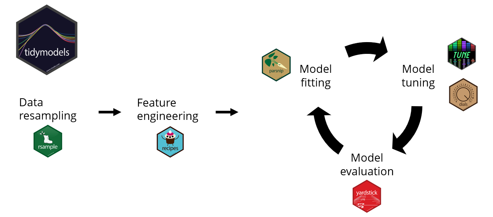

```{r setup, include=FALSE}
knitr::opts_chunk$set(echo = TRUE)
```

# Tidyverse Workflow

Main steps:

1. Read the data

2. Clean the data

3. Explore the data

4. Statistical modelling

6. Communicate the results and findings


Image source: R for Data Science, Grolemund & Wickham 

## Types of Data Science Research Problems

1. Descriptive

2. Exploratory

3. Inferential 

4. Predictive

# Modeling Workflow

1. Data analysis

2. Feature engineering

3. Model fitting

4. Hyper parameter tuning

5. Model evaluation

# Tiydmodels Ecosystem

`tidymodels`: a collection of R packages for modeling and machine learning



Image source: https://rpubs.com/chenx/tidymodels_tutorial

# Tidymodels packages

1. `rsamples` - to split the data into training and testing sets (as well as cross validation sets, etc.)

2. `recipes` - to prepare the data with preprocessing (assign variables and preprocessing steps)

3. `parsnip` - to specify and fit the data to a model

4. `yardstick` and `tune` - to evaluate model performance

5. `workflows` - combining recipe and parsnip objects into a workflow ( makes it easier to keep track of what you have done)


6. `tune` and `dials` - model optimization 


7. `broom` - to make the output from fitting a model easier to read

# Loading `tidyverse`

```{r}
library(tidyverse)
```

# Loading `tidymodels`

```{r}
library(tidymodels)
```


# `rsample` package

Can be used to create training and test data sets

- initial_split()

- training()

- testing()

## Example

```{r, warning=FALSE}
library(palmerpenguins)
data(penguins)
dim(penguins)
```

```{r}
# 80% of the data to the training set and the remaining 20% for testing
penguins_split <- initial_split(penguins, prop = 0.80)
training_p <- training(penguins_split)
dim(training_p)
test_p <- testing(penguins_split)
dim(test_p)
```

When there is a class imbalance we can use `strata` arg in initial_split() ensure that the random split with similar distribution of response variable.

```{r}
library(MLDataR)
glimpse(MLDataR::thyroid_disease)
summary(as.factor(thyroid_disease$ThryroidClass))
```

```{r}
# Create a data split object
thyroiddata_split <- initial_split(
  thyroid_disease,
  prop = 0.8,
  # stratification by outcome variable
  strata = ThryroidClass
)

# Create the training data
thyroid_training <- thyroiddata_split %>% training() 
head(thyroid_training)
class(thyroid_training)
thyroid_training %>% nrow()
summary(as.factor(thyroid_training$ThryroidClass))

# Create the test data
thyroid_test <- thyroiddata_split %>% testing() 
head(thyroid_test)
thyroid_test %>% nrow()

summary(as.factor(thyroid_test$ThryroidClass))

```

 The `rsample` package can also be used to create resamples of a data set, such as cross-validation or the bootstrap
 
## Bootstrap 
 
```{r}
boot_samp <- rsample::bootstraps(penguins, times = 3)
boot_samp
```

## k-fold Cross-validation

```{r}
set.seed(999)
# using rsample package
cv <- vfold_cv(training_p, v = 10)  #v is the number of folds
cv  #10 folds
```

# parsnip: Fitting a linear regression model

- Motivation

    - Package: MASS

      Function: lda

      Code: predict(obj)

    - Package: glm

      Function: stats

      Code: predict(obj, type="response")


- General interface for modelling

- Specifications: model, engine, fit

**Step 1: Model setup**

Inputs to the function

1. Model type (linear regression, random forest)

`linear_reg()`

`rand_forest()`

2. Specify engine (package implementation of algorithm)

`set_engine("name_of_the_package")`

3. Declare mode (classification vs linear regression)

`set_mode("regression")`

`set_mode("classification")`


```{r}
# model setup - linear model
lm_mod <- linear_reg() %>%
  set_engine("lm") %>%
  set_mode("regression")

lm_mod
```


```{r}
## model setup - random forest

rf_mod_c <- rand_forest() %>%
  set_engine("randomForest") %>%
  set_mode("classification")

rf_mod_c


rf_mod_r <- rand_forest() %>%
  set_engine("randomForest") %>%
  set_mode("regression")

rf_mod_r
```


**Step 2: Fitting model**

Example 1:

```{r}
lm_fit <- lm_mod %>%
  fit(body_mass_g ~ bill_length_mm + bill_depth_mm + flipper_length_mm + species + sex, data = training_p)

lm_fit
```

Example 2: 

```{r}
rf_fit <- rf_mod_r %>%
  fit(body_mass_g ~ bill_length_mm + bill_depth_mm + flipper_length_mm + species + sex, data = training_p)

rf_fit
```

Second format

```{r}
rf_randomForest <- rand_forest() %>%
  set_engine("randomForest") %>%
  set_mode("regression") %>%
  fit(body_mass_g ~ bill_length_mm + bill_depth_mm + flipper_length_mm + species + sex, data = training_p)

rf_randomForest
```

Example 3

```{r}
# model
iris_fit1 <- decision_tree(mode =  "classification") %>% 
  # engine
  set_engine("rpart") %>% 
  # fit 
  fit(Species ~ ., data = iris)
iris_fit1

```


```r
# model2
iris_fit2 <- decision_tree(mode =  "classification") %>% 
  # engine
  set_engine("C5.0") %>% 
  # fit 
  fit(Species ~ ., data = iris)
iris_fit2
```

Example 4 

```{r}
# Specify a logistic regression model
logistic_model <- logistic_reg() %>%
  # Set the engine
  set_engine("glm") %>%
  # Set the mode
  set_mode("classification")

# Fit to training data
logistic_fit <- logistic_model %>%
  fit(
    sex ~ body_mass_g + flipper_length_mm ,
    data = training_p
  )

# Print model fit object
logistic_fit
```


## Making prediction - regression

```{r}
test_na_drop <- test_p %>% drop_na()
rf_pred <- rf_randomForest %>%
  predict(new_data = test_na_drop)
head(rf_pred)
```

## Making prediction - classification

```{r}
# Predict outcome class
class_pred <- predict(
  logistic_fit,
  new_data = test_na_drop,
  type = "class"
)

class_pred %>% head()

# Obtain estimated probabilities for each outcome class level
prob_pred <- predict(
  logistic_fit,
  new_data = test_na_drop,
  type = "prob"
)

prob_pred %>% head()

# Combine test set results
pred_results <- test_na_drop %>%
  bind_cols(prob_pred, class_pred)

# View results tibble
pred_results %>%
  head()
```

## Bind data and predictions

```{r}
test_pred <- test_na_drop %>% 
  bind_cols(rf_pred)
head(test_pred)
```

# `yardstick`: Evaluvate Model Performance

input: tibble with predictions and actuals

## Assessing model fit - regression

```{r}
# calculate RMSE
test_pred %>%
  rmse(truth = body_mass_g, estimate = .pred)
```

## `coord_obs_pred()` function

Can be used in a ggplot to create scatterplot of prections vs actuals. In this scatterplot  x- and y-axes have the same exact scale along with an aspect ratio of one.


```{r}
test_pred %>%
  ggplot(aes(x = body_mass_g, y = .pred)) +
  geom_point(alpha = .5) +
  geom_abline(color = "blue", linetype = 2) +
  coord_obs_pred() +
  labs(x = "Actual Body Mass Index (g)", y = "Predicted Body Mass Index (g)")

```

## Assessing model fit - classification


**Confusion matrix**


```{r}
# Calculate the confusion matrix
yardstick::conf_mat(
  pred_results,
  truth = sex,
  estimate =  .pred_class
)

# Calculate the accuracy
yardstick::accuracy(
  pred_results,
  truth = sex,
  estimate =  .pred_class
)


# Calculate the sensitivity
yardstick::sens(
  pred_results,
  truth = sex,
  estimate =  .pred_class
)


# Calculate the specificity
yardstick::spec(
  pred_results,
  truth = sex,
  estimate =  .pred_class
)
```

## Create a custom accuracy measure function to create several accuracy measures together

```{r}
error_measures <- metric_set(
  yardstick::accuracy,
  yardstick::sens,
  yardstick::spec
)


error_measures(
  pred_results,
  truth = sex,
  estimate =  .pred_class)

```


## Confusion matrix

```{r}
confusion_matrix <- conf_mat(
  pred_results,
  truth = sex,
  estimate = .pred_class
) 
confusion_matrix
confusion_matrix %>%  summary()
```

## Visualizing confusion matrix 

### Heatmap

```{r}
conf_mat(
  pred_results,
  truth = sex,
  estimate = .pred_class
) %>%
  # Create a heat map
  autoplot(type = "heatmap")
```

### Mosaic map

```{r}
conf_mat(
  pred_results,
  truth = sex,
  estimate = .pred_class
) %>%
  # Create a mosaic map
  autoplot(type = "mosaic")
```

### ROC curve

```{r}
# Plot ROC curve
pred_results %>%
  # Calculate metrics across thresholds
  roc_curve(
    truth = sex,
    estimate = .pred_male
  ) %>%
  autoplot()
```

### Compute ROC AUC

```{r}
pred_results %>%
  roc_auc(
    truth = sex,
    estimate = .pred_female
  )

```

# Feature Engineering with recipes

`recipes` package provides a pre-processing interface.


1. **Get the ingredients: ** specify the response variable and predictor variables

2. Pre-processing: `step_*`

    `step_center()`
    
    `step_scale()`
    
    `step_log()`
    
    For more information [click here](https://recipes.tidymodels.org/reference/index.html).

3. Provide datasets for recipe steps: `prep`

4. Apply pre-processing: `bake`

## Example

Step 1: Define our `recipe`

```{r}
iris_rec <- recipe(Species ~ ., data = iris)
iris_rec

```

Step 2: Pre-processing

```{r}
iris_steps <- iris_rec %>% 
  # normalize numeric data to have a mean of zero
  step_center(all_numeric()) %>% 
# normalize numeric data to have a standard deviation of one.
  step_scale(all_predictors())
iris_steps
```

Step 3: Preparing our recipe

```{r}
prepped <- prep(iris_steps)
prepped
```

Step 4: Obtain pre-processed dataset

```{r}
bake(prepped, head(iris))
```

# Reference

- [Applied tidymodeling](https://josiahparry.com/slides/tidymodels/xaringan.html#1)