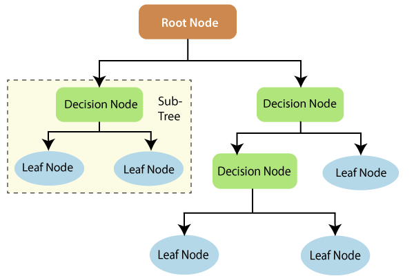

```{r,setup, include=FALSE}
knitr::opts_chunk$set(cache=TRUE)
```

# Classification and Regression Trees (CART)

- Decision trees

- Supervised learning method

- Data driven method

## Model

$$Y = f(X_1, X_2,... X_n) + \epsilon$$
Goal: What is $f$?

## How do we estimate $f$ ?

**Data-driven methods:**

estimate $f$ using observed data without making explicit assumptions about the functional form of 
$f$.

**Parametric methods:**

estimate $f$ using observed data by making assumptions about the functional form of $f$.

## Classification and Regression Trees

1. Classification tree - Outcome is categorical

2. Regression tree - Outcome is numeric

## Classification and Regression Trees

- CART models work by partitioning the feature space into a number of simple rectangular regions, divided up by axis parallel **splits**.

- The **splits** are logical rules that
split feature-space into two **non-overlapping** subregions.

## Example: Feature space

Features: Sepal Length, Sepal Width

Outcome: setosa/versicolor

```{r, echo=FALSE, warning=FALSE, message=FALSE, out.height="70%"}
## Extracted only two species for easy explanation
data <- iris[1:100,]
library(ggplot2)
library(viridis)
ggplot(data, aes(x=Sepal.Length, y=Sepal.Width, col=Species)) + geom_point() + scale_color_manual(values = c("#1b9e77", "#d95f02")) + coord_fixed()
```

## Decision tree

```{r echo=FALSE, warning=FALSE, message=FALSE}
# Load rpart and rpart.plot
library(rpart)
library(rpart.plot)
# Create a decision tree model
tree <- rpart(Species~Sepal.Length + Sepal.Width, data=data, cp=.02)
# Visualize the decision tree with rpart.plot
rpart.plot(tree, box.palette="RdBu", shadow.col="gray", nn=TRUE)

```

## Parts of a decision tree

- Root node

- Decision node

- Terminal node/ Leaf node  (gives outputs/class assignments)

- Subtree

##



Image source: https://www.tutorialandexample.com/wp-content/uploads/2019/10/Decision-Trees-Root-Node.png


## Decision tree

```{r echo=FALSE, warning=FALSE, message=FALSE}
# Load rpart and rpart.plot
library(rpart)
library(rpart.plot)
# Create a decision tree model
tree <- rpart(Species~Sepal.Length + Sepal.Width, data=data, cp=.02)
# Visualize the decision tree with rpart.plot
rpart.plot(tree, box.palette="RdBu", shadow.col="gray", nn=TRUE)

```

## Root node split

```{r, echo=FALSE}
ggplot(data, aes(x=Sepal.Length, y=Sepal.Width, col=Species)) + geom_point() + scale_color_manual(values = c("#1b9e77", "#d95f02")) + coord_fixed() + geom_vline(xintercept = 5.5) 
```

##  Root node split, Decision node split - 1

```{r, echo=FALSE}
ggplot(data, aes(x=Sepal.Length, y=Sepal.Width, col=Species)) + geom_point() + scale_color_manual(values = c("#1b9e77", "#d95f02")) + coord_fixed() + geom_vline(xintercept = 5.5) + geom_hline(yintercept = 3)
```

##  Root node split, Decision node splits

```{r, echo=FALSE}
ggplot(data, aes(x=Sepal.Length, y=Sepal.Width, col=Species)) + geom_point() + scale_color_manual(values = c("#1b9e77", "#d95f02")) + coord_fixed() + geom_vline(xintercept = 5.5) + geom_hline(yintercept = 3) + geom_hline(yintercept = 3.3)
```

## Shallow decision tree

```{r, echo=FALSE}
# Create a decision tree model
tree <- rpart(Species~Sepal.Length + Sepal.Width, data=data, cp=.5)
# Visualize the decision tree with rpart.plot
rpart.plot(tree, box.palette="RdBu", shadow.col="gray", nn=TRUE)
```

## Two key ideas underlying trees

- Recursive partitioning (for constructing the tree)

- Pruning (for cutting the tree back)

- Pruning is a useful strategy for avoiding over fitting.  

- There are some alternative methods to avoid over fitting as well.

## Leo Breiman

**Key references**

Breiman, L., J. Friedman, R. Olshen, and C. Stone, 1984: Classification and regression trees. Wadsworth Books, 358.

Breiman, L., 1996: Bagging predictors. Machine learning, 24 (2), 123--140.

Breiman, Leo (2001). "Random Forests". Machine Learning 45 (1): 5–32. doi:10.1023/A:
1010933404324


## Constructing Classification Trees

**Recursive Partitioning**

- Recursive partitioning splits P-dimensional feature space into nonoverlapping multidimensional rectangles.

- The division is accomplished recursively (i.e. operating on the results of prior division)

## Main questions

- Splitting variable
    
    Which attribute/ feature should be placed at the root node?
      
    Which features will act as internal nodes?
    
- Splitting point

- Looking for a split that increases the homogeneity (or "pure" as possible) of the resulting subsets.

## Example

split that increases the homogeneity 
 
```{r, echo=FALSE}
ggplot(data, aes(x=Sepal.Length, y=Sepal.Width, col=Species)) + geom_point() + scale_color_manual(values = c("#1b9e77", "#d95f02")) + coord_fixed() 
```

## Example (cont.)

split that increases the homogeneity .
 
```{r, echo=FALSE}
ggplot(data, aes(x=Sepal.Length, y=Sepal.Width, col=Species)) + geom_point() + scale_color_manual(values = c("#1b9e77", "#d95f02")) + coord_fixed() + geom_vline(xintercept = 5.5) 
```

## How does a decision tree determine the best split?

Decision tree uses entropy and information gain to select a feature which gives the best split.

## Measures of Impurity

- An impurity measure is a heuristic for selection of the splitting criterion that best separates a given feature space.

- The two most popular measures

    - Gini index
    
    - Entropy measure
    
## Gini index

Gini index for rectangle $A$ is defined by

$$I(A) = 1- \sum_{k=1}^mp_k^2$$

$p_k$ - proportion of records in rectangle $A$ that belong to class $k$

- Gini index takes value 0 when all the records belong to the same class.

- 1 denotes that the elements are randomly distributed across various classes.

## Gini index (cont)

Gini index is at peak when $p_k = 0.5$

## Example: Calculation

## Entropy measure

$$entropy(A) = - \sum_{k=1}^{m}p_k log_2(p_k)$$
