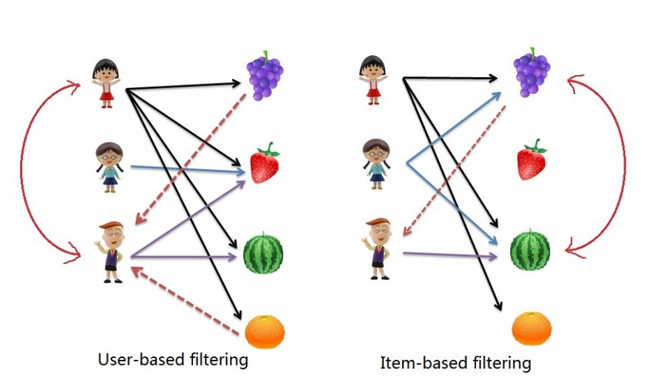

```{r setup, include=FALSE}
knitr::opts_chunk$set(echo = TRUE)
```

# Application: In-class demo

https://www.amazon.com/

# Association rule

- Also called **affinity analysis** or **market basket analysis**.

- Aimed at discovering which groups of products tend to be purchased together.

## Data

Example 1: Purchases of Phone Plates

```{r, echo=FALSE, comment=NA}
Transaction <- 1:10
V1 <- c("red", "white", "white",
        "red", "red", "white", "red", "red", "red", "yellow")
V2 <- c("white", "orange", "blue", "white", "blue", "blue", "blue", "white", "white", NA)
V3 <- c("green", NA, NA, "orange", NA, NA, NA, "blue", "blue", NA)
V4 <- c(rep(NA, 7), "green", NA, NA)
df <- data.frame(Transaction, V1, V2, V3, V4)
df
```

Rule 1: IF {red} THEN {white}

- antecedent/ IF

  eg: {red}


- consequent/ THEN

  eg: {white}


Rule 2: IF {red, green} THEN {white}

- antecedent/ IF

  eg: {red, green}


- consequent/ THEN

  eg: {white}


## Apriori algorithm

Main idea: Generate candidate rules

Step 1: Generate all the rules that would be candidates for indicating associations between items.

**Selecting strong rules**

From many possibilities, the goal is to find the only the rules that indicate a strong dependence between the antecedent and consequent itemsets.

We use 3 measures to measure the strength of association implied by a rule

1. Confidence

2. Lift ratio

## Support of itemset X

Support indicates the populatiry of the item set X.

$$Support(X) = \frac{\text{Number of transactions in which X appears}}{\text{Total number of transactions}}$$
Example:

$$Support({red, white}) = \frac{4}{10} \times 100 \% = 40\%$$

$$Support(X) = \hat{P}(\text{antecedent AND consequent})$$

Exercise: Compute support for all item sets.

## Confidence

Expresses the degree of uncertainty about the IF-THEN rule.

$$Confidence (X \rightarrow Y) = \frac{\text{Number of transactions with both antecedent and consequent itemsets}}{\text{Number of transactions with antecedent itemset}}$$


$$Confidence = \hat{P}(consequent|antecedent)$$


Example:

$${red, white} \rightarrow {green}$$

$$\frac{\text{support of {red, white, green}}}{\text{support of {red, white}}} = \frac{2}{4} \times 100 \% = 50\% $$

Compute confidence for the following rules

1. $$\{green\} \rightarrow \{red\}$$

2. $$\{white, green\} \rightarrow \{red\}$$


## Lift ratio

$$\text{Benchmark confidence} = \frac{\text{No. transactions with consequent itemset}}{\text{No. of transactions in database}}$$


$$\text{Lift ratio} = \frac{\text{confidence}}{\text{benchmark confidence}}$$

# Summary


Image credit: https://wiki.smu.edu.sg/1718t3isss608/Group17_Proposal

# R code

1. Dataset and package

```{r, echo=FALSE}
## dataset
df
library(arules)
```

2. Binary matrix

```{r}
Red <- c(1, 0, 0, 1, 1, 0, 1, 1, 1, 0)
White <- c(1, 1, 1, 1, 0, 1, 0, 1, 1, 0)
Blue <- c(0, 0, 1, 0, 1, 1, 1, 1, 1, 0)
Orange <- c(0, 1, 0, 1, 0, 0, 0, 0, 0, 0)
Green <- c(1, 0, 0, 0, 0, 0, 0, 1, 0, 0)
Yellow <- c(rep(0, 9), 1)
mat <- matrix(c(Red, White, Blue,
                Orange, Green, Yellow), nrow=10)
mat
colnames(mat) = c("Red", "White", "Blue", "Orange", "Green", "Yellow")
```

3. Convert binary index matrix into a transaction database

```{r}
fp.trans <- as(mat, "transactions")
inspect(fp.trans)
```

4. Get rules

```{r}
rules <- apriori(fp.trans, parameter = list(supp=0.2, conf=0.5, target = "rules"))
# inspect the first six rules
inspect(head(sort(rules, by="lift"), n=6))
```

Interpretation: 

- If orange is purchased, then with confidence 1005 white will also be purchased. The rule has a lift ratio of 1.43.

Your turn:

Dataset

```{r}
library(arules)
data(Groceries)
class(Groceries)
head(Groceries)
dim(Groceries)
```

To view the first five transactions

```{r}
inspect(head(Groceries))

```

```{r}
str(Groceries)
```

Item components

```{r}
Groceries@itemInfo$labels[1:20]
```

# Collaborative filtering

- Identifying relevant items for a specific user  from a very large collection of items ("filtering") by considering preferences of many users ("collaboration").

- User-based collaborative filtering: "People like you"

- Item-based collaborative filtering:  Find similar items rather than similar users (what items from all the options are more similar to what the person has already purchased)




Image credit and further reading: https://medium.com/@cfpinela/recommender-systems-user-based-and-item-based-collaborative-filtering-5d5f375a127f

## Dataset: Movie ratings

```{r}
ID <- 1:10
M1 <- c(4, 4, 5, 3, 4, 3, 3, 4, 4, 3)
M5 <- c(1, NA, NA, NA, 5, NA, NA, NA, NA, NA)
M8 <- c(rep(NA, 3), 1, rep(NA, 6))
M17 <- c(rep(NA, 3), 4, rep(NA, 6))
M18 <- c(3, rep(NA, 9))
M28 <- c(3, NA, NA, 4, NA, NA, 2, NA, NA, NA)
M30 <- c(4, NA, NA, 5, NA, 4, 4, NA, 3, NA)
M44 <- c(5, rep(NA, 4), 4, rep(NA, 4))
M48 <- c(rep(NA, 6), 3, rep(NA, 3))
df <- data.frame(ID, M1, M5, M8, M17, M18, M28, M30, M44, M48)
df
summary(df, na.rm=TRUE)

```


# Acknowledgement

The content is directly based on 

Data Mining for Business Analytics: Concepts, Techniques, and Applications in R
Galit Shmueli, Peter C. Bruce, Inbal Yahav, Nitin R. Patel, Kenneth C. Lichtendahl Jr.