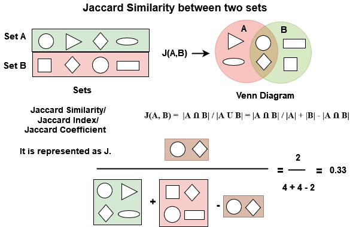

```{r setup, include=FALSE}
knitr::opts_chunk$set(echo = TRUE, comment = NA)
```

# User-User Collaborative Filtering

## Data

```{r, message=FALSE, warning=FALSE}
library(tidyverse)
user <- c("A", "B", "C", "D")
HP1 <- c(4, 5, NA, NA)
HP2 <- c(NA, 5, NA, 3)
HP3 <- c(NA, 4, NA, NA)
TW <- c(5, NA, 2, NA)
SW1 <- c(1, NA, 4, NA)
SW2 <- c(NA, NA, 5, NA)
SW3 <- c(NA, NA, NA, 3)
df1 <- data.frame( HP1, HP2, HP3, TW, SW1, SW2, SW3)
rownames(df1) <- user
df1

```

## Option 1 - Jaccard Distance



Source: https://www.geeksforgeeks.org/how-to-calculate-jaccard-similarity-in-r/#:~:text=Jaccard%20Distance%20is%20a%20measure,where%20J%20is%20Jaccard%20Similarity.

```{r}
df1[is.na(df1)] <- 0
df1
1-proxy::dist(df1,  method = "Jaccard")
```

## Option 2: Cosine similarity

```{r}
a <- as.numeric(df1[1, ])
b <- as.numeric(df1[2, ])
c <- as.numeric(df1[3, ])
d <- as.numeric(df1[4, ])
data2 <- cbind(a, b, c, d)
data2
#calculate Cosine Similarity
library(lsa)
cosine(data2)
```

## Option 3: Centered cosine similarity

```{r}
a <- c(4, NA, NA, 5, 1, NA, NA)
mean_a <- mean(a, na.rm=TRUE)
aa <- a-mean_a
b <- c(5, 5, 4, NA, NA, NA, NA) 
bb <- b-mean(b, na.rm=TRUE)
c <- c(NA, NA, NA, 2, 4, 5, NA)
cc <- c-mean(c, na.rm=TRUE)
d <- c(NA, 3, NA, NA, NA, NA, 3)
dd <- d-mean(d, na.rm=TRUE)
df3 <- data.frame(aa, bb, cc, dd)
df3[is.na(df3)] <- 0
df3
cosine(as.matrix(df3))
cor(as.matrix(df3))
```

Recommendation:

Option 1: Average rating

Take average rating for item 1 from the neighbourhood of $k$ users.


Product $i$ rating for user $x$

$$r_{xi} = \frac{1}{k}\sum_{j=1}^{k}r_{ji}$$


Option 2: Weighted Average Rating

$$r_{xi} = \frac{\sum_{j=1}^{k}s_{xj}r_{ji}}{\sum_{j=1}^{k}s_{xj}}$$

# Item-item collaborative filtering

```{r}
m1 <- c(1, NA, 3, NA, NA, 5, NA, NA, 5, NA, 4, NA)
m1c <- m1 - mean(m1, na.rm = TRUE)
m2 <- c(NA, NA, 5, 4, NA, NA, 4, NA, NA, 2, 1, 3)
m2c <- m2 - mean(m2, na.rm = TRUE)
m3 <- c(2, 4, NA, 1, 2, NA, 3, NA, 4, 3, 5, NA)
m3c <- m3 - mean(m3, na.rm = TRUE)
m4 <- c(NA, 2, 4, NA, 5, NA, NA, 4, NA, NA, 2, NA)
m4c <- m4 - mean(m4, na.rm = TRUE)
m5 <- c(NA, 4, 3, 4, 2, NA, NA, NA, NA, NA, 2, 5)
m5c <- m5 - mean(m5, na.rm = TRUE)
m6 <- c(1, NA, 3, NA, 3, NA, NA, 2, NA, NA, 4, NA)
m6c <- m6 - mean(m6, na.rm = TRUE)
iidf <- data.frame(m1c, m2c, m3c, m4c, m5c, m6c)
iidf
iidf[is.na(iidf)] <- 0
iidf
cosine(as.matrix(iidf))
cor(as.matrix(iidf))
```

Suppose we want to give a prediction to Movie 1 and User 5

We need to find movies that are highest similarity to movie 1 that are also rated by user 5.

Movie 3 and Movie 6 are the neighbourhood movie for movie 1.

```{r}
iidf2 <- data.frame(m1, m2, m3, m4, m5, m6)
iidf2
```

$s_{13} = 0.41$ and $s_{16}=0.5$.

Rating for movie 1 for user 5 is

$$=\frac{(0.41 \times 2) + (0.59 \times 3)}{0.41 + 0.59} = 2.6$$
 For movie 1 user 5 predicted rating is 2.6.